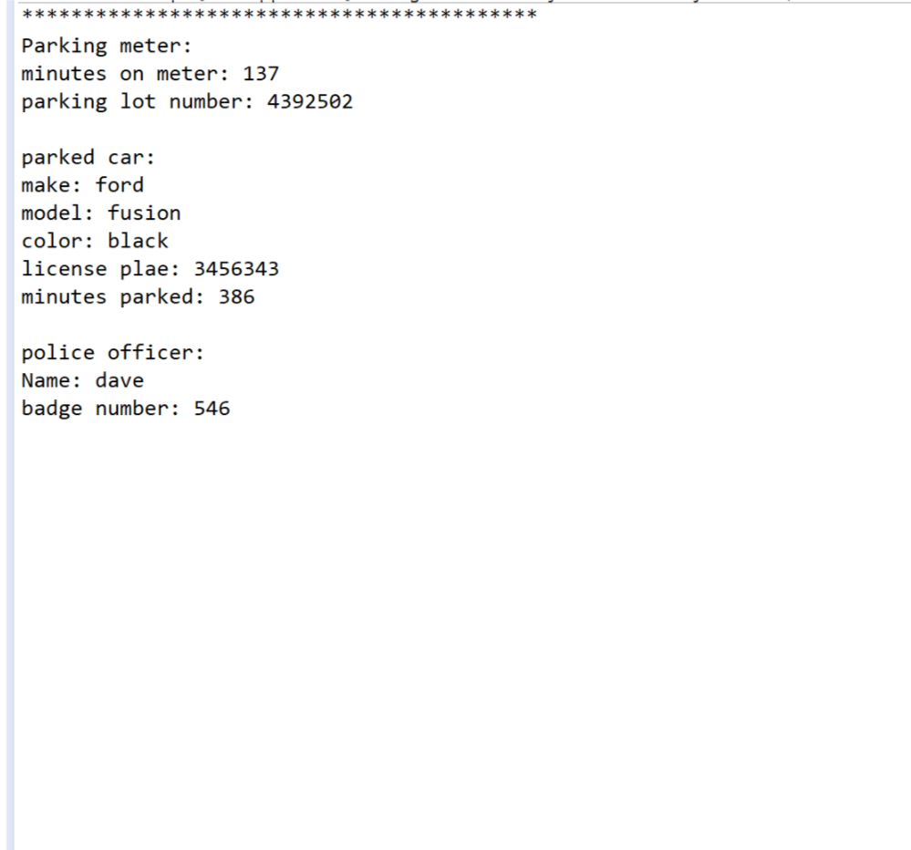
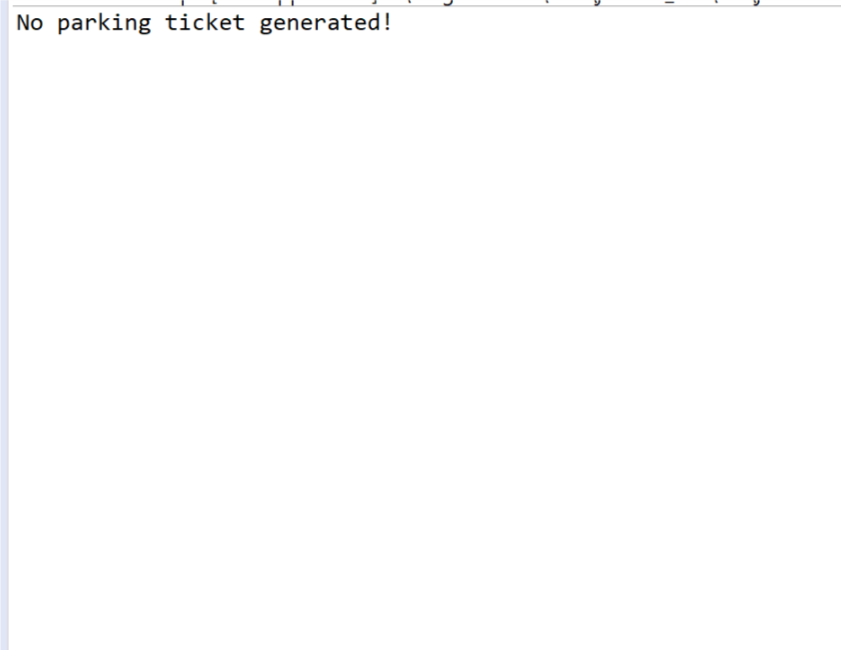

# parking-ticket-simulator-

program designed to simulate a praking ticket based on random values (1-500). If the minutes on the meter is less than the minutes parked a parking ticket will be generated based on the amount of minutes the driver was over the time limit. Java program using composiotion and classes. 

## Samples Outputs 

one ticket generated 

two ticketes generated 

not tickets generated 

